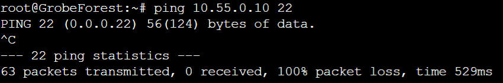
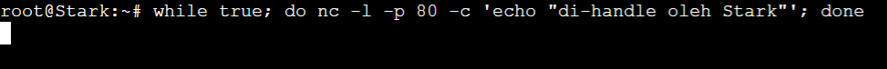

# Laporan Resmi Praktikum Jaringan Komputer Modul 5 2023

**Topic :**

Firewall

**Identity :** 

Kelompok F07 -
Jaringan Komputer (F) </br>
*Insitut Teknologi Sepuluh Nopember*

**Authors :**
| Name                              | Student ID |
| ----------------------------------|------------|
| Arfi Raushani Fikra               | 5025211084 |
| Rafi Aliefian Putra Ramadhani     | 5025211234 |

## Information
Prefix IP **10.55.x.x**

## List of Contents
- [Preparation](#preparation)
    - [Topology](#topology)
    - [Node Config](#node-configuration)
    - [Subnetting & Routing](#subnetting--routing)
    - [Routing & DHCP Config](#routing--dhcp-config)
- [Question 1](#question-1)
- [Question 2](#question-2)
- [Question 3](#question-3)
- [Question 4](#question-4)
- [Question 5](#question-5)
- [Question 6](#question-6)
- [Question 7](#question-7)
- [Question 8](#question-8)
- [Question 9](#question-9)
- [Question 10](#question-10)
- [Obstacle](#obstacle)

## Preparation
### Topology


### Subnetting & Routing
Untuk Pembagian Subnet, IP, Perhitungan VLSM, Tree VLSM, Subnetting dan juga Routing dapat diakses atau dilihat pada link [berikut](https://docs.google.com/spreadsheets/d/1U4_PVoLywDhOSbDzXarHsa6SbyRofl-Nl2wuEeesBkE/edit?usp=sharing). Jika tidak dapat diakses, dapat dilihat pada file Excel yang tertera pada Repository.

### Node Configuration
- **Router**
  - Aura 
    ```
    auto eth0
    iface eth0 inet dhcp

    auto eth1
    iface eth1 inet static
        address 10.55.0.1
        netmask 255.255.255.252

    auto eth2
    iface eth2 inet static
        address 10.55.0.5
        netmask 255.255.255.252
    ```
  
  - Heiter
    ```
    auto eth0
    iface eth0 inet static
        address 10.55.0.2
        netmask 255.255.255.252
        gateway 10.55.0.1

    auto eth1
    iface eth1 inet static
        address 10.55.8.1
        netmask 255.255.248.0
        gateway 10.55.0.1

    auto eth2
    iface eth2 inet static
        address 10.55.4.1
        netmask 255.255.252.0
        gateway 10.55.0.1
    ```

  - Frieren
    ```
    auto eth0
    iface eth0 inet static
        address 10.55.0.6
        netmask 255.255.255.252
        gateway 10.55.0.5

    auto eth1
    iface eth1 inet static
        address 10.55.0.9
        netmask 255.255.255.252
        gateway 10.55.0.5

    auto eth2
    iface eth2 inet static
        address 10.55.0.13
        netmask 255.255.255.252
        gateway 10.55.0.5
    ```

  - Himmel
    ```
    auto eth0
    iface eth0 inet static
        address 10.55.0.14
        netmask 255.255.255.252
        gateway 10.55.0.13

    auto eth1
    iface eth1 inet static
        address 10.55.2.1
        netmask 255.255.254.0
        gateway 10.55.0.13

    auto eth2
    iface eth2 inet static
        address 10.55.0.129
        netmask 255.255.255.128
        gateway 10.55.0.13
    ```

  - Fern
    ```
    auto eth0
    iface eth0 inet static
        address 10.55.0.131
        netmask 255.255.255.128
        gateway 10.55.0.129

    auto eth1
    iface eth1 inet static
        address 10.55.0.17
        netmask 255.255.255.252
        gateway 10.55.0.129

    auto eth2
    iface eth2 inet static
        address 10.55.0.21
        netmask 255.255.255.252
        gateway 10.55.0.129
    ```

- **Host**
  - TurkRegion (1022 Host)
    ```
    auto eth0
    iface eth0 inet dhcp
    ```

  - GrabeForest (512 Host)
    ```
    auto eth0
    iface eth0 inet dhcp
    ```

  - LaubHills (255 Host)
    ```
    auto eth0
    iface eth0 inet dhcp
    ```

  - SchwerMountain (64 Host)
    ```
    auto eth0
    iface eth0 inet dhcp
    ```

- **Web Server**
  - Sein
    ```
    auto eth0
    iface eth0 inet static
        address 10.55.4.2
        netmask 255.255.252.0
        gateway 10.55.4.1
    ```

  - Stark
    ```
    auto eth0
    iface eth0 inet static
        address 10.55.0.10
        netmask 255.255.255.252
        gateway 10.55.0.9
    ```

- **DNS & DHCP Server**
  - Richter (DNS)
    ```
    auto eth0
    iface eth0 inet static
        address 10.55.0.18
        netmask 255.255.255.252
        gateway 10.55.0.17
    ```

  - Revolter (DHCP)
    ```
    auto eth0
    iface eth0 inet static
        address 10.55.0.22
        netmask 255.255.255.252
        gateway 10.55.0.21
    ```

### Routing & DHCP Config
```
# Routing Template
# route add -net <NID subnet> netmask <netmask> gw <IP gateway>
```
- **Routing**
  - Aura
    ```
    # A5
    route add -net 10.55.0.8 netmask 255.255.255.252 gw 10.55.0.6
    # A6
    route add -net 10.55.0.12 netmask 255.255.255.252 gw 10.55.0.6
    # A7
    route add -net 10.55.2.0 netmask 255.255.254.0 gw 10.55.0.6
    # A8
    route add -net 10.55.0.128 netmask 255.255.255.128 gw 10.55.0.6
    # A9
    route add -net 10.55.0.16 netmask 255.255.255.252 gw 10.55.0.6
    # A10
    route add -net 10.55.0.20 netmask 255.255.255.252 gw 10.55.0.6
    # A2
    route add -net 10.55.8.0 netmask 255.255.248.0 gw 10.55.0.2
    # A1
    route add -net 10.55.4.0 netmask 255.255.252.0 gw 10.55.0.2
    ```

  - Fern
    ```
    # default
    route add -net 0.0.0.0 netmask 0.0.0.0 gw 10.55.0.129
    ```

  - Himmel
    ```
    # default
    route add -net 0.0.0.0 netmask 0.0.0.0 gw 10.55.0.13
    # A9
    route add -net 10.55.0.16 netmask 255.255.255.252 gw 10.55.0.131
    # A10
    route add -net 10.55.0.20 netmask 255.255.255.252 gw 10.55.0.131
    ```

  - Heiter
    ```
    # default
    route add -net 0.0.0.0 netmask 0.0.0.0 gw 10.55.0.1
    ```

  - Heiter
    ```
    # default
    route add -net 0.0.0.0 netmask 0.0.0.0 gw 10.55.0.5
    # A7
    route add -net 10.55.2.0 netmask 255.255.254.0 gw 10.55.0.14
    # A8
    route add -net 10.55.0.128 netmask 255.255.255.128 gw 10.55.0.14
    # A9
    route add -net 10.55.0.16 netmask 255.255.255.252 gw 10.55.0.14
    # A10
    route add -net 10.55.0.20 netmask 255.255.255.252 gw 10.55.0.14
    ``` 

- **DHCP Config**
  - Revolte (DHCP Server)
    ```
    apt-get update
    apt-get install isc-dhcp-server -y
    dhcpd --version

    echo '
    # Defaults for isc-dhcp-server (sourced by /etc/init.d/isc-dhcp-server)

    # Path to dhcpd'\''s config file (default: /etc/dhcp/dhcpd.conf).
    #DHCPDv4_CONF=/etc/dhcp/dhcpd.conf
    #DHCPDv6_CONF=/etc/dhcp/dhcpd6.conf

    # Path to dhcpd'\''s PID file (default: /var/run/dhcpd.pid).
    #DHCPDv4_PID=/var/run/dhcpd.pid
    #DHCPDv6_PID=/var/run/dhcpd6.pid

    # Additional options to start dhcpd with.
    #       Don'\''t use options -cf or -pf here; use DHCPD_CONF/ DHCPD_PID instead
    #OPTIONS=""

    # On what interfaces should the DHCP server (dhcpd) serve DHCP requests?
    #       Separate multiple interfaces with spaces, e.g. "eth0 eth1".
    INTERFACES="eth0"
    ' > /etc/default/isc-dhcp-server

    echo '
    # A1 ke GrobeForest
    subnet 10.55.4.0 netmask 255.255.252.0 {
        range 10.55.4.3 10.55.7.254; # range ip untuk GrobeForest
        option routers 10.55.4.1; # ip gateway ke subnet A1 (Heiter-eth2)
        option broadcast-address 10.55.7.255; # broadcast ID subnet A1
        option domain-name-servers 10.55.0.18; # ip dns server Richter-eth0
        default-lease-time 180; # 3 menit
        max-lease-time 5760; # 96 menit
    }

    # A2 ke TurkRegion
    subnet 10.55.8.0 netmask 255.255.248.0 {
        range 10.55.8.2 10.55.15.254; # range ip untuk TurkRegion
        option routers 10.55.8.1; # ip gateway ke subnet A2 (Heiter-eth1)
        option broadcast-address 10.55.15.255; # broadcast ID subnet A2
        option domain-name-servers 10.55.0.18; # ip dns server Richter-eth0
        default-lease-time 180; # 3 menit
        max-lease-time 5760; # 96 menit
    }

    # A3
    subnet 10.55.0.0 netmask 255.255.255.252 {
    }

    # A4
    subnet 10.55.0.4 netmask 255.255.255.252 {
    }

    # A5
    subnet 10.55.0.8 netmask 255.255.255.252 {
    }

    # A6
    subnet 10.55.0.12 netmask 255.255.255.252 {
    }

    # A7 ke LaubHills
    subnet 10.55.2.0 netmask 255.255.254.0 {
        range 10.55.2.2 10.55.3.254; # range ip untuk LaubHills
        option routers 10.55.2.1; # ip gateway ke subnet A7 (Himmel-eth1)
        option broadcast-address 10.55.3.255; # broadcast ID subnet A7
        option domain-name-servers 10.55.0.18; # ip dns server Richter-eth0
        default-lease-time 180; # 3 menit
        max-lease-time 5760; # 96 menit
    }

    # A8 ke SchwerMountain
    subnet 10.55.0.128 netmask 255.255.255.128 {
        range 10.55.0.130 10.55.0.254; # range ip untuk SchwerMountain
        option routers 10.55.0.129; # ip gateway ke subnet A8 (Himmel-eth2)
        option broadcast-address 10.55.0.255; # broadcast ID subnet A8
        option domain-name-servers 10.55.0.18; # ip dns server Richter-eth0
        default-lease-time 180; # 3 menit
        max-lease-time 5760; # 96 menit
    }

    # A9
    subnet 10.55.0.16 netmask 255.255.255.252 {
    }

    # A10
    subnet 10.55.0.20 netmask 255.255.255.252 {
    }

    ' > /etc/dhcp/dhcpd.conf

    service isc-dhcp-server restart
    ```

  - Heiter dan Himmel (DHCP Relay)
    ```
    apt-get update
    apt-get install isc-dhcp-relay -y
    service isc-dhcp-relay start

    echo '
    SERVERS="10.55.0.22" # IP DHCP Server Revolte-eth0
    INTERFACES="eth0 eth1 eth2" # add eth0 as well to prevent failure
    OPTIONS=""
    ' > /etc/default/isc-dhcp-relay

    echo 'net.ipv4.ip_forward=1' > /etc/sysctl.conf

    service isc-dhcp-relay restart
    ```


## Question 1
> Agar topologi yang kalian buat dapat mengakses keluar, kalian diminta untuk mengkonfigurasi Aura menggunakan iptables, tetapi tidak ingin menggunakan MASQUERADE.

Agar dapat mengakses keluar, biasanya kita menggunakan MASQUERADE, namun untuk memenuhi ketentuan pada soal dimana diminta tanpa MASQUERADE, kita dapat menggunakan pengaturan sebagai berikut pada node Aura
```
Aura_to_NAT_IP=$(ip -4 addr show eth0 | grep -oP '(?<=inet\s)\d+(\.\d+){3}')

iptables -t nat -A POSTROUTING -o eth0 -j SNAT --to-source $Aura_to_NAT_IP
```

Dengan pengaturan tersebut, kita melakukan penangkapan terhadap IP pada interface eth0 milik Aura, yaitu interface yang terhubung dengan NAT, setelah itu memasukkannya ke sebuah variabel `Aura_to_NAT_IP`. Setelah itu digunakan pada opsi `--to-source` pada pengaturan di atas. Perlu diketahui bahwa IP interface eth0 milik Aura ini bersifat dinamis, maka dari itu diperlukan penggunaan variabel untuk menampung nilai IP-nya.

Pengujian dapat dilakukan pada node lain dengan cara melakukan `ping google.com`. Disini pengujian dilakukan di node host TurkRegion. Sebelum melakukan perintah `ping google.com`, terlebih dahulu menjalankan perintah berikut
```
echo nameserver 192.168.122.1 > /etc/resolv.conf
```
atau pada contoh ini, telah dibuatkan sebuah script khusus menjalankan perintah tersebut, yaitu script `echons.sh`. Setelah itu lakukan test ping ke google.com, seperti perintah berikut
```
ping google.com
```

Diperoleh hasil sebagai berikut


## Question 2
> Kalian diminta untuk melakukan drop semua TCP dan UDP kecuali port 8080 pada TCP.

Untuk memenuhi permintaan soal, kita dapat menambahkan pengaturan pada node host, untuk pembahasan kali ini, dimisalkan pada salah satunya, yaitu GrobeForest.
```
iptables -F

# Drop semua koneksi UDP
iptables -A INPUT -p udp -j DROP

# Drop semua koneksi TCP kecuali port 8080
iptables -A INPUT -p tcp --dport 8080 -j ACCEPT
iptables -A INPUT -p tcp -j DROP
```

Pada pengaturan tersebut, terlebih dahulu dilakukan `Flush` untuk memastikan tidak ada rules lain pada node tersebut. Setelah itu, ditambahkan aturan yang melakukan DROP terhadap semua koneksi UDP, maupun TCP, namun untuk TCP dikecualikan bagi koneksi yang menuju port 8080, dengan kata lain, diizinkan (ACCEPT) khusus koneksi port 8080 TCP pada node GrobeForest tersebut. Pengujian dilakukan dengan menggunakan `netcat`, oleh karena itu perlu dilakukan instalasi `netcat` dengan perintah berikut.
```
apt-get update
apt-get install netcat -y
```

Instalasi tersebut juga dilakukan pada node yang akan digunakan untuk testing koneksi ke GrobeForest, misalnya disini menggunakan node Sein. Setelah instalasi netcat, lakukan testing dengan cara berikut.

buka koneksi port `8080` di GrobeForest dengan perintah berikut
```
nc -l -p 8080
```

Lalu hubungkan koneksi dari Sein dengan perintah berikut
```
nc [ip GrobeForest] 8080
```
*IP GrobeForest bersifat dinamis, sehingga perlu diperiksa terlebih dahulu IP-nya. Setelah itu lakukan percakapan atau pertukaran pesan antara kedua node. Untuk test blokir pada selain port `8080`, dapat mengikuti langkah yang sama, namun mengganti nomor port-nya. Berikut hasil test-nya.


Dapat dilihat pertukaran pesan melalui port `8080` dapat dilakukan, namun tidak untuk port selain `8080`, pada contoh di atas yaitu `8081`

## Question 3
> Kepala Suku North Area meminta kalian untuk membatasi DHCP dan DNS Server hanya dapat dilakukan ping oleh maksimal 3 device secara bersamaan, selebihnya akan di drop.

Untuk melakukan pembatasan jumlah ping ini, dapat ditambahkan pengaturan berikut pada node-node yang bertugas sebagai DHCP Server yaitu Revolte dan DNS Server yaitu Richter. 
```
iptables -F

# status ESTABLISHED mengacu pada koneksi yang sudah terbentuk, sedangkan RELATED mengacu pada koneksi yang terkait dengan koneksi yang sudah ada
# mengizinkan paket yang terkait dengan koneksi yang sudah ada atau yang sudah mapan. 
iptables -A INPUT -m state --state ESTABLISHED,RELATED -j ACCEPT

# menolak lalu lintas ping jika jumlah koneksi melebihi batas 3
iptables -A INPUT -p icmp -m connlimit --connlimit-above 3 --connlimit-mask 0 -j DROP
```

Testing dapat dilakukan dengan melakukan ping pada node Revolte atau Richter tersebut (ping ke IP Revolte atau Richter), dari node lain. Dilakukan pengujian dengan menggunakan 4 node berbeda yang mencoba ping di saat yang bersamaan, diperoleh hasil sebagai berikut.


Dari gambar tersebut, terdapat 3 node yang bisa melakukan ping ke Revolte (IP : 10.55.0.22) yaitu TurkRegion, Sein, dan GrobeForest, adapun Stark tidak bisa memperoleh hasil untuk ping-nya.

## Question 4
> Lakukan pembatasan sehingga koneksi SSH pada Web Server hanya dapat dilakukan oleh masyarakat yang berada pada GrobeForest.


## Question 5
> Selain itu, akses menuju WebServer hanya diperbolehkan saat jam kerja yaitu Senin-Jumat pada pukul 08.00-16.00.


## Question 6
> Lalu, karena ternyata terdapat beberapa waktu di mana network administrator dari WebServer tidak bisa stand by, sehingga perlu ditambahkan rule bahwa akses pada hari Senin - Kamis pada jam 12.00 - 13.00 dilarang (istirahat maksi cuy) dan akses di hari Jumat pada jam 11.00 - 13.00 juga dilarang (maklum, Jumatan rek).

Untuk membatasi akses pada WebServer di waktu-waktu tertentu, perlu menambahkan sedikit rule pada WebServer. Masukkan aturan/rule berikut:
```
# Tolak koneksi SSH dari GrobeForest ke Sein dan/atau Stark pada istirahat makan siang (Senin-Jumat, 12:00-13:00)
iptables -A INPUT -p tcp --dport 22 -s 10.55.4.4 -m time --timestart 12:00 --timestop 13:00 --weekdays Mon,Tue,Wed,Thu -j DROP

# Tolak koneksi SSH dari GrobeForest ke Sein dan/atau Stark pada saat Jumatan (Jumat, 11:00-13:00)
iptables -A INPUT -p tcp --dport 22 -s 10.55.4.4 -m time --timestart 11:00 --timestop 13:00 --weekdays Fri -j DROP
```

Atur waktu untuk keperluan testing (Contoh di jam 12:45 di hari Selasa tanggal 19 Desember 2023)
```
date --set="2023-12-19 12:45:00"
```

Setelah itu pada **Sein/Stark** jalankan command berikut:
```
nc -l -p 22
```

Kemudian, Testing dilakukan pada **GrobeForest** dengan menjalankan command berikut:
```
nc [ip Sein/Stark] 22
```

Dan masukkan pesan bebas. Hasilnya jika berhasil pesan yang dikirimkan dari GrabeForest tidak akan masuk pada Sein/Stark.

- Tes di Hari Senin-Kamis pada Jam 12:00 - 13:00


- Test di hari Jumat pada Jam 11:00 - 13:00


Testing juga bisa dilakukan dengan melakukan ping pada IP + Port yang telah ditetapkan rule





## Question 7
> Karena terdapat 2 WebServer, kalian diminta agar setiap client yang mengakses Sein dengan Port 80 akan didistribusikan secara bergantian pada Sein dan Stark secara berurutan dan request dari client yang mengakses Stark dengan port 443 akan didistribusikan secara bergantian pada Sein dan Stark secara berurutan.

<div align=justify>

Untuk menyelesaikannya diperlukan aktivasi aturan pada iptables di router yang terhubung dengan WebServer, termasuk penggunaan **Heiter**. Masukkan beberapa aturan berikut:
```
# Load balancing HTTP (Port 80) antara Sein dan Stark
iptables -A PREROUTING -t nat -p tcp --dport 80 -d 10.55.4.2 -m statistic --mode nth --every 2 --packet 0 -j DNAT --to-destination 10.55.4.2
iptables -A PREROUTING -t nat -p tcp --dport 80 -d 10.55.4.2 -j DNAT --to-destination 10.55.0.10

# Load balancing HTTPS (Port 443) antara Sein dan Stark
iptables -A PREROUTING -t nat -p tcp --dport 443 -d 10.55.0.10 -m statistic --mode nth --every 2 --packet 0 -j DNAT --to-destination 10.55.0.10
iptables -A PREROUTING -t nat -p tcp --dport 443 -d 10.55.0.10 -j DNAT --to-destination 10.55.4.2
```

Kemudian menjalankan Testing Port 80 dan 443 pada **Sein** dan **Stark**:
```
while true; do nc -l -p 80 -c 'echo "di-handle oleh Stark"'; done
while true; do nc -l -p 80 -c 'echo "di-handle oleh Sein"'; done

while true; do nc -l -p 443 -c 'echo "di-handle oleh Stark"'; done
while true; do nc -l -p 443 -c 'echo "di-handle oleh Sein"'; done
```

**Port 80:**




**Port 443:**


Setelah itu, testing dapat dilakukan pada **TurkRegion(Host)** dengan menjalankan command:
```
nc [ip stark/sein] [80/443]
```


Hasil-nya akan menunjukkan Port di-handle secara bergantian oleh Sein dan Stark.


## Question 8
> Karena berbeda koalisi politik, maka subnet dengan masyarakat yang berada pada Revolte dilarang keras mengakses WebServer hingga masa pencoblosan pemilu kepala suku 2024 berakhir. Masa pemilu (hingga pemungutan dan penghitungan suara selesai) kepala suku bersamaan dengan masa pemilu Presiden dan Wakil Presiden Indonesia 2024.

Untuk melakukan pembatasan pada **Revolte** dalam mengakses WebServer, dilakukan beberapa aturan pada **Stark/Sein** dengan menambahkan aturan berikut:
```
iptables -F
iptables -A INPUT -s 10.55.0.20/30 -p tcp --dport 80 -m time --datestart "2023-12-16" --datestop "2024-03-20" -j DROP
```

Sekarang sudah termasuk "Masa Pemilu" dan 20 Maret 2024 merupakan tanggal akhir "Rekapitulasi Pemungutan Suara"

Setelah itu, lakukan testing dengan memasukkan command berikut:
```
nmap [ip Stark/Sein] 80
```


Hasil pada Revolte terindikasi Filtered/Gagal sedangkan pada LaubHills terindikasi aman.


## Question 9
> Sadar akan adanya potensial saling serang antar kubu politik, maka WebServer harus dapat secara otomatis memblokir  alamat IP yang melakukan scanning port dalam jumlah banyak (maksimal 20 scan port) di dalam selang waktu 10 menit. (clue: test dengan nmap)

Dalam penyelesaian nya dibutuhkan beberapa aturan/rule pada WebServer, seperti berikut:

Pertama, diperlukan pembuatan rantai iptables baru untuk scanning port dengan nama "scan_port" 
```
iptables -N scan_port
```

Setelah itu Melakukan pengecekan dan blokir jika terdapat lebih dari 20 pemindaian port dari alamat IP yang sama dalam waktu kurang dari 10 menit. Serta menentukan jumlah pemindaian port yang diizinkan dalam periode waktu yang telah ditentukan yaitu 20.
```
iptables -A INPUT -m recent --name scan_port --update --seconds 600 --hitcount 20 -j DROP
iptables -A FORWARD -m recent --name scan_port --update --seconds 600 --hitcount 20 -j DROP
```

Kemudian tambahkan rule untuk menerima pemindaian baru, jika alamat IP pemindainya (IP yang melakukan scanning port) baru harus ditambahkan ke dalam "recent" list dan paket akan diterima (ACCEPT).
```
iptables -A INPUT -m recent --name scan_port --set -j ACCEPT
iptables -A FORWARD -m recent --name scan_port --set -j ACCEPT
```

Hasil running rule:


Dan testing dapat dilakukan pada Host/Node selain Stark & Sein dengan melakukan ping pada ip Stark/Sein:
```
ping [ip Stark/Sein]
```


Dapat dilihat bahwa paket yang diterima hanya sampai *20 packet* dan sisanya terhitung error dengan akurasi *packet loss* seperti yang tertera pada gambar. 


## Question 10
> Karena kepala suku ingin tau paket apa saja yang di-drop, maka di setiap node server dan router ditambahkan logging paket yang di-drop dengan standard syslog level. 

Pada WebServer perlu ditambahkan 1 rule LOG seperti berikut:
```
iptables -A INPUT  -j LOG --log-level debug --log-prefix 'Package Dropped' -m limit --limit 1/second --limit-burst 10
```

Batas/Limit jumlah log yang bisa dilakukan dalam 1 waktu yaitu 10 dengan 1 log/s. Jika rule telah dijalankan maka dapat di-check menggunakan `iptables -L`


Hasil dapat dilihat bahwa terdapat rule bertipe LOG untuk melihat paket yang telah dropped.


## Obstacle
- Sempat mengalami kendala saat melakukan pembuktian waktu (hari, tanggal, jam)
- Untuk mengatasi poin 1 akhirnya diatur manual menggunakan `date --set`
- Sempat eror pada Soal Distribusi Paket, tapi akhirnya dicoba lagi bisa


## Ucapan manis dari Kita! 
Thank you Jaringan Komputer 2023, dengan semua orang-orang hebat didalamnya. We are both proud of all of you. Well done, see u on top. ❤️🙏🏻
